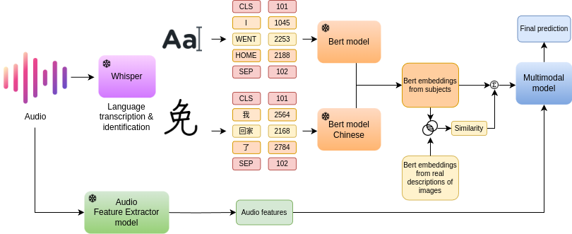

# Cognitive Insights Across Languages: Enhancing Multimodal Interview Analysis - Taukadial challenge

Cognitive Insights Across Languages: Enhancing Multimodal Interview Analysis

## Overview

This repository contains the code used for the TAUKADIAL challenge. The work implements a pipeline where various approaches have been considered to tackle the task. The challenge comprises two distinct tasks: predicting Mild Cognitive Impairment (MCI) and forecasting a cognitive score based on the Mini-Mental State Examination (MMSE).

The dataset has been provided by the TalkBank project. Data includes audio recordings in both Chinese and English languages. A Whisper model has been employed to generate transcriptions of the audios. Simultaneously, features from these audios have been extracted using OpenSmile and Opendbm libraries. Bert embeddings have also been utilized from the transcriptions. Various approaches have been proposed to develop a final multimodal model.

To access the Taukadial dataset, please contact the TalkBank project and request permission to use their data.


**Overview of proposed architecture**

## Usage

To run our code, the following steps must be performed to obtain the processed data that will fit the deployed models. Please utilize Python version 3.8 to install the opendbm library and acquire the necessary audio features. Once you have obtained and stored the features, you can remove this dependency from the requirements.txt file and utilize a different version of Python.

```
sudo apt update
sudo apt install ffmpeg cmake libsndfile1 sox
pip install -r requirements.txt
python3 preprocess_dataset.py
./scripts/train.sh
```